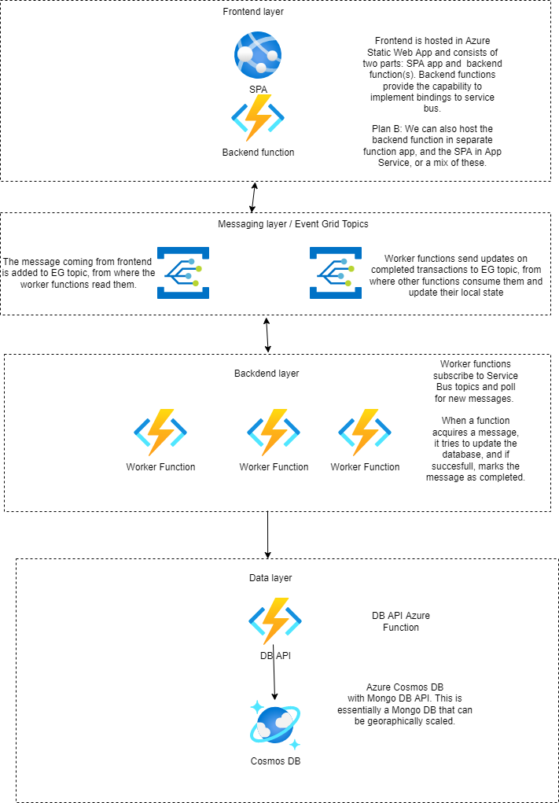

# Design plan for Distributed Systems Fall 20222

## Team

- Jari Sokka
- Jukka Koskelin
- Ville Muilu

## Project Topic

The aim of this project is to create a simple webshop, where the worker nodes updating warehouse inventory are distributed to different geograpic regions. Another theme is to explore a public cloud PaaS (Platform-as-a-Service) service offerring and reference architectures for building a modern, fault-tolerant high-availability system. The public cloud chosen for this project is Microsoft Azure.

## Project Technical Description

The webshop we are building has several architectural layers:

- Frontend, a single page app made with React.js and backend functions, hosted in Azure Static WebApps.
- A messaging layer that frontend calls, which distributes frontend messages for the worker nodes. Azure Event Grid is used as messaging service.
- Backend layer that consists of the geographically distributed worker nodes hosted in Azure Serverless Functions.
- Data layer emulating a warehouse. Data will be stored in an nosql-database, possibly MongoDB. While the aim of the project is not to use a separate data storage for each of the nodes, using MongoDB API of Azure CosmosDB would make this possible. 
- Logging is handled by Application Insights, where are the functions will be connected.

## Nodes

Worker nodes are responsible for querying and updating data in warehouse database, and simulate a high-availability scenario where the nodes have been deployed to different geographic regions in Azure cloud. They subscribe to Event Grid Topics where messages from Frontend are pushed into, consume messages with HTTP trigger functions that execute a specific task.

As we are dealing with a high-availability scenario and services in different Azure regions are notoriously wobbly (not really, but we can simulate this by turning off functions), we also need to implement fault tolerance to the nodes. Event Grid does not care what happens to a message after it's consumed, so the worker nodes must each keep note what was the last message it consumed and wheter that execution was succesfully completed. If not, it needs to consume the message again. This is also implemented via the Event grid Topics; each node push notifications on succesfull transactions to Event Grid, where other nodes consume the notifications and store them locally (though we probably implement these local states as just separate collections in the shared database).

## Messages

**TODO: Add message schematincs from frontend implementation.**

The frontend implements three different API calls: GET all the items and their current quantities, GET the current quantity of a certain item, and UPDATE the quantity of a certain item.

Azure Event Grid [Event schema](https://learn.microsoft.com/en-us/azure/event-grid/event-schema#event-schema) describes the full event schema and an example of custom event we are using would be:

```
[{
  "id": "1807",
  "eventType": "recordInserted",
  "subject": "myapp/vehicles/motorcycles",
  "eventTime": "2017-08-10T21:03:07+00:00",
  "data": {
    "products": [
      {
        "id": 1,
        "ean": 1111,
        "pic": "HTML is easy",
        "name": "product one",
        "saldo": 5
      },
      {
        "id": 2,
        "ean": 2222,
        "pic": "HTML is easy",
        "name": "product two",
        "saldo": 5
      },
      {
        "id": 2,
        "ean": 3333,
        "pic": "HTML is easy",
        "name": "product three",
        "saldo": 5
      }
    ]
  },
  "dataVersion": "1.0",
  "metadataVersion": "1",
  "topic": "/subscriptions/{subscription-id}/resourceGroups/{resource-group}/providers/Microsoft.EventGrid/topics/{topic}"
}]
```

Where _data_ element describes the actual payload of the event message.

## Some Architectural choices



### Frontend

Frontend is hosted in Static Web Apps, which actually offers hosting of two different services: the single page app and and backend functions (which are just Azure Functions deployed into the Static Web App resource). In this case, it is probably easier to create the bindings for Event Grid in the function code than it is in the SPA.

[Azure Static Web Apps Overview](https://learn.microsoft.com/en-us/azure/static-web-apps/overview)

### Messaging

Azure offers two separate messaging services that could be used to distribute messages to worker nodes: *Event Grid* and *Service Bus*. Event Grid is the simpler of the two as it is meant only to distribute events that other services react to, and it does not really care who reacts or acts on the messages. Service Bus, on the other hand, would be used in a real high availability scenario.

For this project, we chose Event Grid as messaging middleware, as we want to implement both messaging between frontend and database (via the backend nodes) and messaging between nodes through the same middleware. 

[Event Grid vs Event Hub vs Service Bus](https://learn.microsoft.com/en-us/azure/event-grid/compare-messaging-services)<br>
[Azure Event Grid](https://learn.microsoft.com/en-us/azure/event-grid/)<br>
### Worker nodes

Worker nodes are implemented as serverless Azure Functions, which are stateless (unless we really really need stateful functions). Functions subscribe to Event Grid topics, and are triggered by incoming events. While the functions are stateless in technical sense, they do store every event they complete in their own database collection. We then either implement a logic for re-trying to execute an event which was consumed, but not succesfully executed, or a logic where every worker checks if an event was already executed by another node, before executing it by themselves.

Note: This will probably lead all kinds of interesting synchronization issues, but solving those is probably the meat of this exercise anyway. If solving these becomes too hard, we can always utilize plan B and use Service Bus.

__Requirement mapping for nodes__

* Running on a separate computer / virtual machine: We create each function as it's own resource and deploy them to separate Azure Regions.
* have its own IP-address: See [naming and node discovery](#naming-and-node-discovery) below.
* communicate with at least two other nodes only by using Internet protocol based message: At least 3 nodes that communicate via events (see [event schema](#messages) above)
exchange
* be able to express their state and/or readiness for sessions towards other nodes: Publishing and subscribing to events on which node has completed which frontend event should be sufficent for this.

### Data layer

Main questions with data layer are wheter it provides rich enough API for the functions to use out-of-the-box, or if we need to implement a simple api for storing and reading the data. Using a distributed data layer is an advanced topic that can be explored if time permits (then the obvious choice is to use Azure CosmosDB and distribute it to same geographic locations where worker nodes are, and play with the [consistency levels](https://learn.microsoft.com/en-us/azure/cosmos-db/consistency-levels)).

## Required Functionalities

### Shared Distributed State

This is implemented in the worker nodes and in it's simplest it is logging of the events received (from frontend) and executed by the worker, which could then be used for re-consuming an event that was not succesfully executed. The state needs to be stored somewhere, and the easiest option would be just to store the state in database.  

One option would be to implement a pattern, where every consumed message is stored into an Azure Storage Account by the function reading the events/queue, and another function would consume the event/message and perform the actual action against the database. But this feels like too complicated approach for this project.

### Naming and Node discovery

Azure Functions are assigned an unique url of (resource name).azurewebsites.net, and in case of functions directly messaging each other, we can store a list of the function urls and form a complete url of a function call by combining the address and path to a speficic function like https://myworkernode1.azurewebsites.net/api/helloworld. 

A more refined way of handling the intra-node messaging would be to just implement an Event Grid or Service Bus topic where the nodes are registed as message consumers, but not sure if this would be considered as a discovery of nodes.

Third option would be to create a public or private DNS zone and create DNS records with a friendly name; using a private DNS zone would require creating a virtual network and configuring the services to use it (with Event Grid having some limitations) and would likely be too time consuming approach for this project.

### Synchronization and consistency

Using Event Grid as messaging layer requires us to implement these in some form (using Service Bus would probably solve them for us), so we need to implement an Event Grid Topic through which nodes communicate which frontend events they have completed.

Consistency could be implemented by distributing the data layer as described in the [Data Layer](#data-layer) above. Using an eventual consistency mode of Cosmos DB would probably lead to implementing all kinds of interesting synchronization things into the worker nodes, as the database shards in different geograpchies might hold an entirely different opinion of what amount of which item is available at any given time (not a really realistic scenario, but whatever).

### Fault Tolerance

Same as above; with Service Bus, a lot of the fault tolerance issues are handled by the messaging service. With Event Grid we need to implement node-to-node communication. So our fault tolerance approach is to ensure that every event is executed at least once by implementing a re-execution if no node has a succesful execution of a certain event in their local state.

We deploy the worker node to different Azure regions, which gives us some fault tolerance in the technical sense (Azure Regions usually have three separate datacenters, so our nodes are covered for major outages, which should be enough for this project - no need to go full High Availability here, we hope).

### Consensus

Given our scenario, implementing some kind of joint decision -making -mechanism does not really make sense. We might be able to implement something if we decide that nodes handle the re-tries of failed events - they might decide between themselves if they agree that a certain event has not been processed and which node would then re-consume the said event.